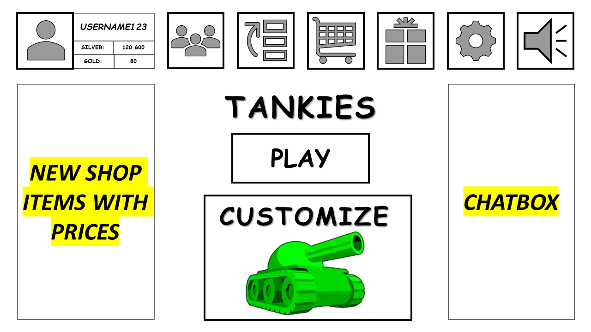

Felhasználói dokumentáció
=======================

&nbsp;

&nbsp;

Tartalom:
--------

1. Általános leírás

    1.1 A játék keletkezése
   
    1.2 A játék célja

2. A játék indítása

3. A játék használata

    3.1 A felhasználói felület

      * 3.1.1 First menu

      * 3.1.2 Login menu
 
      * 3.1.3 Main menu
    
      * 3.1.4 Games menu
    
    3.2 A Játék felhasználói felülete

4. Irányítás és gombok
 
	 4.1 Tank irányítása
    
	* 4.1.1 Irányítás egy Felhasználó esetén
    
	* 4.1.2 Irányítás két Felhasználó esetén
   
	4.2 Általános írányítás játékon belül
    
	4.3 Általános irányítás menükben

5. Hibaüzenetek

&nbsp;

&nbsp;

-----------------------
1, Általános leírás 
==========

1.1. A játék keletkezése
-------------------------
    
A Tankies nevű játék 2022 első felében született a Miskolci Egyetem Gépész mérnöki és informatikai kar Programtervező informatikusai és Mérnökinformatikusok által a Szoftver technológiiák cég kérése által. A készítő csapatra Szoft-Tech Games néven lehet hivatkozni, amely 5 főből állt.
    
    
A Játék teljes elkészítésére sajnos nem jutott elegendő idő, ezért a játékot Alphaban adták ki.

1.2. A játék célja
-------------------------
    
    
A játék legfőbb célja a felhasználó avagy felhasználók szórakoztatása, akár internet hozzáférés nélkül. Azonban ezen kívül még izgalmasabb online lehetőséget is nyújt az adrenalin növeléséhez.
    
    
A legfontosabb feladata a játék élvezetes menetének indítása futása és lezárása.

A lehetőségeket pontosabban leírja a játék specifikációja. 

-------------------
2, A játék indítása
==================

A játék Windows, MacOS és Linux operációs rendszereken tud elindulni. és szükséges hozzá egy legalább 2014 utáni JavaSE. A 2020-as JavaSE 8.0 ra a leg optimalizáltabb a játék.

Az ajánlott felbontás 1920x1080 de hibák nélkül indul a játék 400x600 -ban is. A képernyő felbontásának a méretét felismeri a játék és a lehető legnagyobbat teszi alapértelemzetté.

A játékot a parancsikon futtatásával lehet indítani.

-------------------------
3, A program használata
=======================

3.1. A felhasználói felület a menükben
-------------------------------------

A játék indításakor a játék neve fogadja a felhasználót, valamint négy lehetőség gombok formájában.

	
A gombok közt az egér mozgatásával és célzásával, avagy a billentyűzeten az "UP-ARROW","DOWN-ARROW","LEFT-ARROW","RIGHT-ARROW" nyilakkal lehet közlekedni.

	
Amennyiben a kurzor egy bizonyos gomb fölé ér az a gomb egy animációval dinamikusan vastagabb körvonalat kap. Billenytűzetet használva a kurzor a gomb közepére ugrik és szintén gy animációval dinamikusan vastagabb körvonalat kap.

A gombokra kattintva (bal klikk benyomása és elengedése) vagy "ENTER" billenytűvel lehet előrébb haladni a menüben.

A gombokon szereplő szöveggel a felhasználó a számára megfelelő irányba navigálhatja magát, például fiók létrehozása nélkül szeretne játszani: "[PLAY AS GUEST]" gomb kibálasztásával teheti meg.	

3.1.1. First menu
----------------

[PLAY AS GUEST] - Játék vendégként. Ebben az esetben a felhasználó csak bizonyos játékmódokban tud játszani ilyen például az 1 vs AI, az 1 vs 1 random ellenfél ellen.

[LOGIN] - Erre a gombra nyomva lehetősége nyílik a felhasználónak bejelentkezni.

[REGISTER] - Erre a gombra nyomva lehetősége nyílik a felhasználónak fiókot létrehozni

[music icon] - Erre a gombra nyomva a felhasználó kapcsoló ként tudja ki és bekapcsolni a játék háttérzenéjét.

3.1.2 Login Menu
--------------

[USERNAME] - Itt a szöveg alatti táblába kattintva lehet beírni a felhasználónevet.

[PASSWORD] - Itt a szöveg alatti táblába kattintva lehet beírni a jelszót.

[LOGIN] - Ezt a gombot választva próbálkozhat belépni a fiókjába.

[CONTINUE WITH GOOGLE] - Erre a gombra nyomva beléphet Google segítségével.

[CONTINUE WITH GOOGLE] - Erre a gombra nyomva beléphet Facebook segítségével.

[back icon] - Erre a gombra nyomva a felhasználó visszalép az előző menüre.

[music icon] - Erre a gombra nyomva a felhasználó kapcsoló ként tudja ki és bekapcsolni a játék háttérzenéjét.

3.1.3 Main menu
---------------

[user icon] - Erre a gombra nyomva a felhasználó szerkeszteni tudja a fiókját.

[friends icon]  - Erre a gombra nyomva a felhasználó lenyitja a barátok fület, amiben hozzáadni, törölni és keresni tud barátokat.

[ranklist icon]  - Erre a gombra nyomva a felhasználó meg tudja nézni a ranglistákat.

[shop icon]  - Erre a gombra nyomva a felhasználó megnyitja a játék beli boltot (Shop menu).

[gift icon]  - Erre a gombra nyomva a felhasználó képes szerencse ajándékát kinyitni.

[settings icon]  - Erre a gombra nyomva a felhasználó megnyitja a játék beállításait (Settings menu).

[music icon] - Erre a gombra nyomva a felhasználó kapcsoló ként tudja ki és bekapcsolni a játék háttérzenéjét.

	
[PLAY] - Erre a gombra nyomva a felhasználónak lehetősége nyílik több játék közül választani, mivel megnyílik a Játékok menü (Games menu).

[CUSTOMIZE] - Erre a gombra nyomva a felhasználónak lehetősége nyílik a tankjának a szerkesztésére.

3.1.4 Games menu
------------

[back icon] - Erre a gombra nyomva a felhasználó visszalép az előző menüre.

[settings icon]  - Erre a gombra nyomva a felhasználó megnyitja a játék beállításait (Settings menu).

[music icon] - Erre a gombra nyomva a felhasználó kapcsoló ként tudja ki és bekapcsolni a játék háttérzenéjét.

A Felhasználónak lehetősége van kiválasztós módszerrel módot választani. 

[ONLINE] - Internet elérés esetén a felhasználó tud játszani más játékosokkal világ szerte.

[OFFLINE] - Amennyiben ezt választja a felhasználó, nincs szüksége internet elérésre ahhoz hogy játszani tudjon.

A Felhasználónak lehetősége van kiválasztós módszerrel játékfajtát választani. 

[1 VS 1] - Egy az egy ellen játékmód, ebben a játékfajtában amennyiben [ONLINE] mód van kiválasztva, két játékos küzd egymás ellen. [OFFLINE] - mód esetén a felhasználó egy gép ellen harcol (AI).

[2 VS 2] - Kettő - kettő ellen játékmód, ebben a játékfajtában négy játékos küzd egymás ellen kettő-kettes csapatokra bontva. [OFFLINE] mód ennél a játékfajtánál nem elérhető.

[2 VS AI] - Kettő az AI ellen játékmód, ebben a játékfajtában amennyiben [ONLINE] mód van kiválasztva, két interneten csatlakozott felhasználó harcol két gép ellen (AI). [OFFLINE] mód esetén egy eszközön két felhasználó harcol, két gép ellen (AI).

[FFA] - Mindenki mindenki ellen (Free For All). Ebben a Játékmódban mindenki (4 Felhasználó) a túlélésért és a pontszerzésért harcol egymás ellen. [OFFLINE] mód ennél a játékfajtánál nem elérhető.

A Felhasználó választhat játékkomolyság szintet is, amennyiben lejátszott tíz [CASUAL] játékot abban a kiválasztott játékfajtában.

[CASUAL] - Egyszerű játék, káosz a leggyakoribb tényező itt. A kezdő játékosoknak tökéletes hely megtanulni az alapokat, vagy szórakozni vágyó haladók gyülekező helye. A játékban a vesztéssel nem veszít semmit egyik Felhasználó sem, nyeréssel kissebb ajándékokat lehet szerezni.

[RANKED] - Haladó szintű játékosoknak egy olyan mód, ahol meg tudják mutatni hogy mennyire jók a játékban. Rangokat lehet szerezni, amit a nyert játékok felfelé visznek, a vesztettek pedig kétszeresen lefelé. A nyeremények nagyobbak minél nagyobb rangú egy játékos. (A top 1% játékosokat meg lehet találni a [ranklist icon] - gombra nyomva a Main menu -ben)

Amennyiben a játékos a barátjával szeretne játszani, minden játékmódban megteheti a [+] ikonra nyomva az "INVITE A FRIEND" szöveg alatt. Ez az ikon felnyitja a barátok felületet ahol meg lehet hívni más Felhasználókat.

Ha mindent kiválasztott a Felhasználó akkor a [START GAME] gombra nyomva elíndíthatja a kiválasztott játékot.

3.2 A Játék felhasználói felülete
---------------------------------

[exit icon] - Erre a gombra kattintva megkérdezi a játék a felhasználót, hogy biztosan ki szeretne-e lépni, valamint felsorolja a következményeket. Például a RANKED módban a kilépés rangpont vesztéssel valamint eltiltással jár. Első alkalom 5 perc, második 10, a harmadik 30 perc ezután pedig 1 napos eltiltás jár minden esetben. Ez a számláló minden hónap első napjában nullázódik.

[settings icon]  - Erre a gombra nyomva a felhasználó megnyitja a játék beállításait (Settings menu).

[music icon] - Erre a gombra nyomva a felhasználó kapcsoló ként tudja ki és bekapcsolni a játék háttérzenéjét.

A Játék egy a képernyőtől kisebb téglalapban játszódik, a téglalap mérete sosem nyúlik ki a megadott helyről, az arányai a pálya formájától függően véltozhatnak. Például 12x7 (mint ábrálova), de akarmilyen arány lehet 6x3 minimummal. A négyzet is elfogadott (7x7). Ez a pálya egy gép által algoritmust használva véletlenszerűen generál egy olyan pályát amiben egyenlő távolságra születnek egymástól a játékosok a pálya sarkaiba. Az algoritmus szerint a pálya egy több helyen nyílt labirintus, ahol legalább egy útvonalat követve el lehet érni a másik Játékos vagy gép tankját. 

A falakon, legyen az akerete a pályának vagy a labirintus része pattognak a kilőtt golyók fizikának megfelelően. A golyók sebessége nem változik, nem lassul le és nem gyorsul. A golyó képes felrobbantani minden tankot, függetlenül attól hogy kitől származik. Ettől kivételet képez a csapat mód ahol a golyó a csapattárshoz érve kiad egy segződés hangot, de nem robban fel a tank.

A tankok formája egy téglalap, ami kinézettől független hitbox-al (olyan terület ahol ha a golyó eltalálja felrobban) rendelkeznek. Ez a hitbox határozza meg a halál zónáját a tanknak, valamint azt hogy milyen mozgást tud végezni. Erre egy példa az, amikor egy tank teljesen párhuzamosan megy egy fal mellett szinte azt érintve, akkor képtelen forogni, hiszen a fal útban van. ebben az esetben csak előre és hátra tud mozogni, hogy újra tudjon mozogni vissza kell tolatnia addig amíg nincs fal már mellette. Amennyiben a falnak üzközve megáll egy tank, de a forgásban nem gátolja abban az esetben szabadon tud forogni addig, amíg egy másik része hozzá nem ér a falhoz.

A téglalap fölött található a Játékosok, avagy a gépek (random generált) neve. A nevek fölött a tankok kinézete, amelyet a játékos állított be vagy amit a gép generált a saját magának. 

Ezek közt található három fontos adat:

* [ROUND n] - A körök száma, ahol az "n" a bizonyos kört jelenti ami éppen folyik.

* [GOAL: n POINTS] - a szerezni kívánt pontok száma a nyeréshez. Ahol az n egy szám. Ez alapértelmezettként 10.

* [x  :  y]  - ez a jelenlegi állást jelzi a két ellenfél vagy csapat között. Ahol "x" a bal oldali csapat pontját jelöli, és "y" a jobb oldali csapat pontját jelöli.

--------------------
4.Irányítás és gombok
----------------------

4.1 Tank irányítása
-------------------

4.1.1 Irányítás egy Felhasználó esetén:
----------------------------------------

* Előre haladás: Előre haladni a "W" vagy az "UP-ARROW" gombokkal lehet. Addig tud előre haladni a játékos, amíg egy falnak nem ütközik. Ha egy bizonyos szögben ütközik a játékos a falhoz nem fog a fal felé fordulni a tank, csak megáll abban a bizonyos szögben.

* Hátra haladás: Hátra haladni az "S" vagy az "DOWN-ARROW" gombokkal lehet. Addig tud hátra haladni a játékos, amíg egy falnak nem ütközik. Ha egy bizonyos szögben ütközik a játékos a falhoz nem fog a fal felé fordulni a tank, csak megáll abban a bizonyos szögben.

* Balra forgás: Bal oldalra (óramutatóval ellentkető irányba) fordulni az "A" vagy a "LEFT-ARROW" gombokkal lehet. Addig tud forogni egy játékos, amíg a tank egyik része a falhoz nem ér. Az előre vagy a hátra haladással kombinálva a játékos képes haladás közben is forogni, kanyarodni. 

* Jobbra forgás: Jobb oldalra (óramutatóval megegyező irányba) fordulni a "D" vagy a "RIGHT-ARROW" gombokkal lehet. Addig tud forogni egy játékos, amíg a tank egyik része a falhoz nem ér. Az előre vagy a hátra haladással kombinálva a játékos képes haladás közben is forogni, kanyarodni. 

* Lövés a tankkal: A Tankkal a Felhasználó négy különböző billentyűvel is tud lőni. Ilyen a "0","SPACEBAR","RIGHT-SHIFT" és a "NUM0".

4.1.2 Irányítás két Felhasználó esetén:
----------------------------------------

* Előre haladás: Előre haladni az első Felhasználó a "W" gombbal tud, amíg a második Felhasználó az "UP-ARROW" gombbal tud. Addig tud előre haladni a játékos, amíg egy falnak nem ütközik. Ha egy bizonyos szögben ütközik a játékos a falhoz nem fog a fal felé fordulni a tank, csak megáll abban a bizonyos szögben.

* Hátra haladás: Hátra haladni az első Felhasználó az "S" gombbal tud, amíg a második Felhasználó a "DOWN-ARROW" gombbal tud. Addig tud hátra haladni a játékos, amíg egy falnak nem ütközik. Ha egy bizonyos szögben ütközik a játékos a falhoz nem fog a fal felé fordulni a tank, csak megáll abban a bizonyos szögben.

* Balra forgás: bal oldalra (óramutatóval ellentkető irányba) fordulni az első Felhasználó az "A" gombbal tud, A második Felhasználó a "LEFT-ARROW" gombbal tud. Addig tud forogni egy játékos, amíg a tank egyik része a falhoz nem ér. Az előre vagy a hátra haladással kombinálva a játékos képes haladás közben is forogni, kanyarodni. 

* Jobbra forgás: jobb oldalra (óramutatóval megegyező irányba) fordulni az első Felhasználó a "D" gombbal tud, A második Felhasználó a "RIGHT-ARROW" gombbal tud. Addig tud forogni egy játékos, amíg a tank egyik része a falhoz nem ér. Az előre vagy a hátra haladással kombinálva a játékos képes haladás közben is forogni, kanyarodni. 

* Lövés a tankkal: A Tankkal az első Felhasználó a "0" vagy a "SPACEBAR" gombbal tud lőni, míg a második Felhasználó a "RIGHT-SHIFT" vagy a "NUM0" gobokkal tud lőni.

4.2 Általános írányítás játékon belül
-----------------------------------

"ESCAPE" billentyű - Az Escape menu-t jeleníti meg. Offline módban megállítja a játék menetét, míg online módban csak a játék menete fölé jelenik meg áttetszően. Itt megtalálható minden opció amit egy játékon belül lehet csinálni, például a beállításokm segítség irányításhoz, szünet kérés, feladás, valamint a kilépés a játékból is.

"ENTER" billenytű - A chat megnyitása. Chaten belüli irányítások:

* "ESCAPE" billenytű - kilépés chatből.

* "ENTER" billentyű - Üzenet elküldése és kilépés chatből. Üres üzenet esetén csak kilépés chatből.

* "TAB" billentyű - Váltás ALLCHAT és TEAMCHAT között csapat módban.  

"M" billentyű - Kapcsoló módon ki és be lehet kapcsolni a zenét.

"F" és "F11" billenytűk - A játékot váltani tudja ablakos és teljes képernyős mód között.

"F1" billenytű - Segítség az írányításhoz.

"F4" billenytű - Szünet kérése. RANKED módban lehet 1 perces szünetet kérni játék közben.

"F6" billentyű - Feladás, avagy csapat esetén feladás szavazása. Amennyiben a teljes csapat egyetért fel lehet adni.

"F7" billenytű - Egyetértés a feladás szavazásban.

"F8" billentyű - Nem válasz a feladás szavazásra.

4.3 Általános irányítás menükben
-------------------------------
"ESCAPE" billentyű - Visszalépés az előző menüre. Main menü esetén felugrik egy ablak két lehetőséggel (mindkét lehetőség megkérdezi hogy biztos e benne):

* [LOG OUT] - Kijelentkezés fiókból, ez a First menu-re visz vissza.

* [EXIT GAME] - A játék bezárása és a Felhasználó visszajuttatása az asztalára. Bezárás 

Mozgás a menüben gombok között a nyilak (UP-ARROW, DOWN-ARROW, LEFT-ARROW, RIGHT-ARROW) segítségével is történhet. A kiválasztott elembe pedig az "ENTER" billentyű megnyomásával lehet belépni.

"M" billentyű - Kapcsoló módon ki és be lehet kapcsolni a zenét.

"F" és "F11" billenytűk - A játékot váltani tudja ablakos és teljes képernyős mód között.

"ENTER" billenytű - A chat megnyitása. Chaten belüli irányítások:

* "ESCAPE" billenytű - kilépés chatből.

* "ENTER" billentyű - Üzenet elküldése és kilépés chatből. Üres üzenet esetén csak kilépés chatből.

* "TAB" billentyű - Váltás REGIONCHAT, CLANCHAT, SQUADCHAT és legutoljára felkeresett 3 barát között.

------------------
5.Hibaüzenetek
-------------

Mivel a játék még Alphaban van a hibaüzeneteket kérjük küldjék el nekünk a kód alatti [REPORT ERROR] gombbal. Egyéb kérdésekért és válaszokért kérjük keresse fel a folyamatosan bővülő FAQ oldalunkat: www.SoftTechGames.com/Tankies/FAQ

