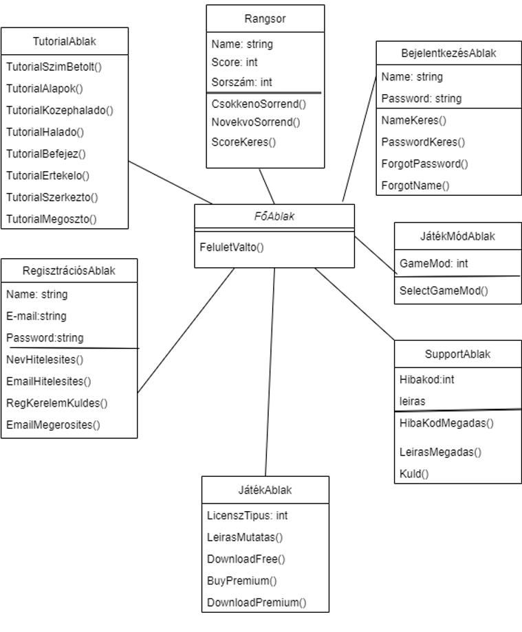
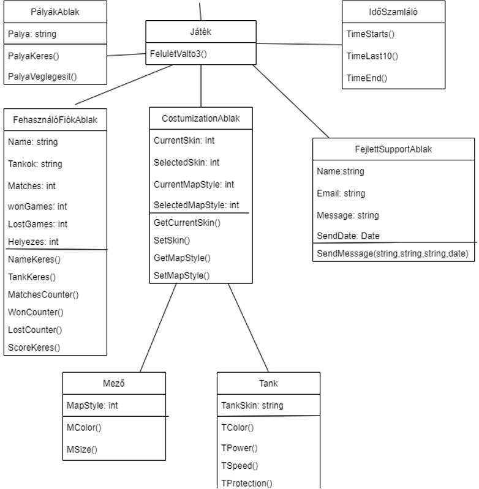
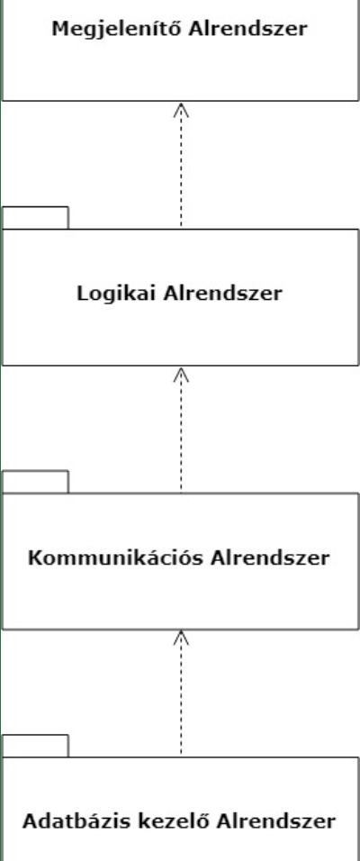
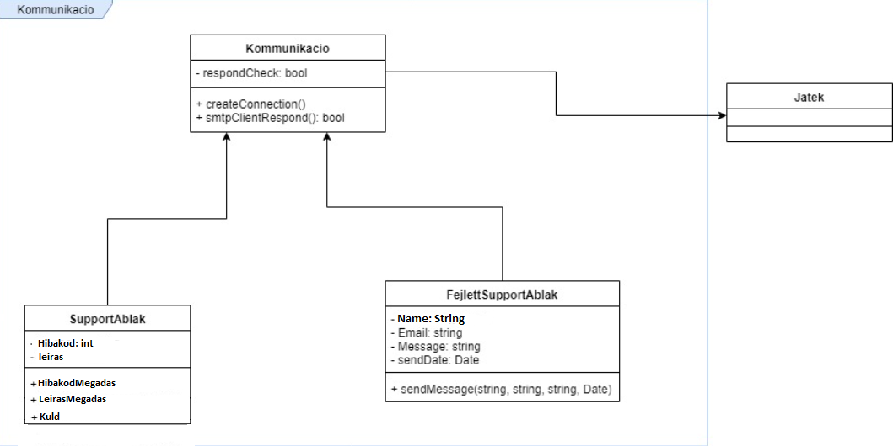

<h3>Csoport neve: SoftTech Games  
Feladat sorszáma: H4  
Feladat címe: Negyedik Beadandó </h3>

&nbsp;

&nbsp;

&nbsp;

&nbsp;

<h1 align="center">Analízis Modell</h1>

&nbsp;

&nbsp;

&nbsp;

&nbsp;

Gyakorlatvezető:

<h2 align="center">Krizsán Zoltán</h2>

| Sándor Máté    | AQUSP7          | samate113@gmail.com     |
|:--------------:|:---------------:|:------------------------------------:|
| Szabó Martin   | JDVK0Y          | szabo.martin@student.uni-miskolc.hu    |
| Balázs Tamás   | HM23GB          | balazs.tamas@student.uni-miskolc.hu    |
| Ádám Róbert    | G3LZYU          | adam.robert@student.uni-miskolc.hu     |
| Bordás Dávid   | D2NGJO          | devidbordas@gmail.com   |

&nbsp;

&nbsp;

&nbsp;

2021.10.19

1, Bevezetés
=========
Ebben a dokumentumban foglaljuk mindazon információkat, amelyek a Tankos asztali alkalmazás tervezése során ezidáig megfogalmazódott és körvonalazódott, amelyek a szoftver implementációjának szempontjából elengethetetlenül fontosak.
A következőkben tárgyaljuk a létrehozni kívánt alrendszer komponensek kapcsolatait, azok statikus-, illetve dinamikus modelljét, valamint a fontosabb osztályok diagramjával szemléltetjük azok tulajdonságait, metódusait.

&nbsp;

2, Osztálydiagram
=========

&nbsp;

2.1, Osztályok felsorolása
=========
<ul>
  <li>FőAblak: Ez az osztály felelős az alkalmazás fő ablakának megjelenítéséért. Ebben jelenik meg a többi ablak.
  <li>JátékMódAblak: Ez az osztály a játékmód kiválasztásában vesz részt, hogy 1 player, vagy több playeres játék induljon el vagy online vagy Al ellen.
  <li>TutorialAblak: Ebben az osztályban érhető el a játék tutorialja.
  <li>BejelentkezésAblak: Ez az osztály tartalmazza a bejelentkezős űrlapot, amellyel be tudunk jelentkezni a felhasználói fiókunkba.
  <li>SupportAblak: Ez az osztály a support opciónkat jeleníti meg.
  <li>Rangsor: Ebben az osztályban az adatbázisból lekérdezhetünk bizonyos dolgokat, például egy játékos pontszáma, stb.
  <li>RegisztrációsAblak: Ez az osztály tartalmazza a regisztrációs űrlapot, amellyel létre tudunk hozni egy új felhasználói fiókot.
  <li>JátékAblak: A játék megjelenítéséért felelős osztály.
  <li>Játék: Ez az osztály a játékunk motorja, ez működteti a játékot és bizonyos funkciókat.
  <li>PályákAblak: Ez az osztály felelős a pályák létrehozásáért.
  <li>FelhasználófiókAblak: A felhasználófiókhoz tartozó adatok módosításáért felelős osztály.
  <li>FejlettSupportAblak: Ennek az osztálynak a feladata a kapcsolat létesítése/tartása a felhasználó és az adminisztrátorok között.
  <li>IdőSzámláló: Ez az osztály az idő számlálására lett létrehozva, amelynek a játék során jelentősége van.
  <li>CustomizationAblak: A játékos által használt karakter kinézetének módosításáért és a pályák stílusának megváltoztatásáért felelős osztály,
  <li>Tank: Ez az osztály a figura mozgásáért felelős.
  <li>Mező: Ez az osztály a pályán lévő mezők osztálya.
</ul>
    

&nbsp;

2.2, Alrendszerek
=========

<ul>
  <li>Megjelenítő alrendszer: Az alkalmazás grafikus elemeinek megjelenítéséért felelős alrendszer.
  <li>Logikai alrendszer: A játék logikájáért felelős alrendszer.
  <li>Kommunikációs alrendszer: Az üzenetküldésért felelős alrendszer.
  <li>Adatbázis kezelő alrendszer: A program adatbázisát kezelő alrendszer.
</ul>

&nbsp;

3 Az adatbázis kezelő alrendszer modellje
=========

Ez az alrendszer felelős a játékhoz kapcsolódó összes adatbázissal kapcsolatos műveletért. Például regisztráció során ide kerülnek a megadott adatok, az alkalmazás megvételének időpontja, így a licensz is itt tárolódik el. A Support felületen küldött üzenetek adatai (küldés ideje, feladó stb.) is az adatbázisban helyezkednek el. Emellett a rangsor megjelenítése is az adatbázisból történő lekérdezés útján valósul meg.
Az alrendszer tartalmazza tehát ezekhez a műveletekhez szükséges kapcsolatokat: RegisztraciosAblak, Rangsor, CustomizationAblak, BejelentkezesAblak osztályokkal. 

Az osztályok között 1-1 kapcsolat van.
Az adatbázist az IDBase osztály segítségével lehet elérni és kezelni.

&nbsp;

3.2 Dinamikus modell
=========

3.3 Operációk azonosítása
=========

Az "OK" gomb megnyomására a adatbáziskezelő alrendszer osztályainak metódusai kerülnek meghívásra, a "Mégsem" gombok megnyomására eltűnnek az adatbeviteli ablakok, és az előző ablak jelenik meg.

3.4, Az analízis modell osztályainak listája
=========
3.4.1, RegisztrációsAblak
=========

<li>Felelőssége, feladata: Új felhasználók regisztrálása a játék adatbázisában.
<li>Együttműködők: FoAblak.
<li>Attribútumok:
  
| Név        | Típus          | Leírás                  |
|:----------:|:--------------:|:-----------------------:|
| Name       | String         | Felhasználó játékneve   |
| Password   | String         | Felhasználó jelszava    |
| Email      | String         | Felhasználó email címe  |
  
<li>Operációk:

| Név        | Argumentumok        | Működés, feladat                  |
|:----------:|:--------------:|:-----------------------:|
| NevHitelesites       | String         | Felhasználó játéknevének ellenörzése   |
| EmailHitelesites   | String         | Felhasználó emailjének ellenörzése|
| RegKerelemKuldes      | String, int        | Felhasználó kérelem küldés  |
| EmailMegerosites     | String         | Felhasználó aktiválása  |
  

3.4.2, BejelentkezésAblak
=========

  <li>Felelőssége, feladata: A megadott felhasználói adatok ellenőrzése a játék adatbázisában és ellenőrzés utáni elbírálás.
  <li>Együttműködők: FoAblak.
  <li>Attribútomok:
    
| Név        | Típus          | Leírás                  |
|:----------:|:--------------:|:-----------------------:|
| Name       | String         | Felhasználó játékneve   |
| Password   | String         | Felhasználó jelszava    |
    
  <li>Operációk:
    
| Név        | Argumentumok        | Működés, feladat                  |
|:----------:|:--------------:|:-----------------------:|
| NameKeres     | String         | Felhasználó játéknevének ellenörzése   |
| PasswordKeres   |    String     | Felhasználó emailjének ellenörzése|
| ForgotPassword      |        | Felhasználó ha elfelejti a jelszavát segitő  |
| ForgotName     |         |Felhasználó ha elfelejti a nevét segitő  |
    

3.4.3, Rangsor
=========

  <li>Felelőssége, feladata: A játékosok ki listázása az adatbázisból a felhasználó által megadott rendszerezésben.
  <li>Együttműködők: FoAblak.
  <li>Attribútumok:
    
| Név        | Típus          | Leírás                  |
|:----------:|:--------------:|:-----------------------:|
| Name       | String         | Felhasználó játékneve a ransorban  |
| Score   | int         | Felhasználó pontja     |
| Sorszam   | int         |    Felhasználó helye a rangsorban |
    
  <li>Operációk:
      
| Név        | Argumentumok        | Működés, feladat                  |
|:----------:|:--------------:|:-----------------------:|
| CsokkenoSorrend     |          | a rangsort csökkenő sorrendbe állítja   |
| NovekvoSorrend   |          | a rangsort növekvő sorrendbe állítja|
| ScoreKeres      | int        | Felhasználó rákereshet pontszámára  |

3.4.4, CustomizationAblak
=========

  <li>Felelőssége, feladata: A játékos által használt karakter kinézetének módosítása, a pályák stílusának megváltoztatása.
  <li>Együttműködők: JatekAblak.
  <li>Attribútumok:
    
| Név        | Típus          | Leírás                  |
|:----------:|:--------------:|:-----------------------:|
| CurrentSkin       | int         | Tank színének megadása  |
| SelectedSkin   | int         | Tank színének meglévő választása     |
  | CurrentMapStyle   | int         |    Pálya stílus csinálás |
  | SelectedMapStyle   | int         | Meglévő pálya kiválasztás     |
    
  <li>Operációk:
    
 | Név        | Argumentumok        | Működés, feladat                  |
|:----------:|:--------------:|:-----------------------:|
| GetCurrentSkin     |         | tank szín választás   |
| SetSkin   |     int    | tank színének megváltoztatása|
| GetMapStyle      |        | pálya stílus választás  |
| SetMapStyle     |     int    |pálya stílus változtatása  |

    
4 Kommunikációs alrendszer modellje
=========
4.1 Kapcsolatok pontosítása
=========

A kommunikációs alrendszer felelős az alkalmazás egyes részei és a felhasználó közötti, valamint a regisztráció során az adatbázis szerver (TCP/IP protokoll segítségével) közötti kommunikáció (információcsere) biztosításáért. Logikailag az adatbázis kezelő alrendszer felett helyezkedik el.

Tartalmazza a SupportAblak, FejlettSupportAblak osztályokat. A SupportAblak osztály a FoAblak osztály leszármazottja, a FejlettSupportAblak osztály a JatekAblak osztály leszármazottja. Tekintve, hogy egyszerre egy időben csak egy üzenetet lehet a felhasználó által írni/küldeni, 1-1 kapcsolat van az osztályok között.

4.2 Operációk azonosítása
=========

A SupportTeam felé az OK (billentyűzeten Enter) gomb megnyomásával küldhető az üzenetdoboz tartalma, FejlettSupportAblak esetén további paraméterekkel együtt. A mégse gomb (billentyűzeten Esc) visszalépteti a felhasználót az előző képernyőre.

4.3 Analízis modell osztálydiagramja
=========

4.4 Analízis modell osztályának listája
=========
4.4.1 SupportAblak
=========

  <li>Felelőssége, feladata: Kapcsolat létesítése a felhasználók és az adminisztrátorok között anonim módon.
  <li>Együttműködők: FoAblak.
  <li>Attribútumok:
    
 | Név        | Típus          | Leírás                  |
|:----------:|:--------------:|:-----------------------:|
| Hibakod       | int         | a probléma hibakódját kimutatja  |
| leiras   | string         | a hibakód megfogalmazása     |
    
  <li>Operációk:
    
| Név        | Argumentumok        | Működés, feladat                  |
|:----------:|:--------------:|:-----------------------:|
| HibaKodMegadas     | int        | a probléma hibakódját kimutatja   |
| LeirasMegadas   |         | a hibakód megfogalmazása|
| Kuld      |        | a felhasználó ha nem tudja megoldani a problémát elküldheti a supportTeamünknek  |
    
4.4.2 FejlettSupportAblak
=========

  <li>Felelőssége, feladata: Kapcsolat létesítése/tartása a felhasználó és az adminisztrátorok között.
  <li>Együttműködők: JatekAblak.
  <li>Attribútumok:
    
| Név        | Típus          | Leírás                  |
|:----------:|:--------------:|:-----------------------:|
| Name       | String         | Felhasználó felhasználóneve  |
| Email   | string         | Felhasználó Email címe    |
| Message      | String         | Felhasználó üzenete  |
| SendDate   | Date         | Küldés dátuma    |
    
  <li>Operációk:
    
| Név        | Argumentumok        | Működés, feladat                  |
|:----------:|:--------------:|:-----------------------:|
| SendMessage | String,string,string,date    | A felhasználó üzenetének elküldése a megadott argumentumokkal. |

    
4.4.3 FejlettSupportAblak
=========

  <li>Felelőssége, feladata: Kapcsolat létesítése/tartása a felhasználó és az adminisztrátorok között.
  <li>Együttműködők: JatekAblak.
  <li>Attribútumok:
      | Név        | Típus          | Leírás                  |
|:----------:|:--------------:|:-----------------------:|
| Name       | String         | Felhasználó felhasználóneve  |
| Email   | string         | Felhasználó Email címe    |
 | Message      | String         | Felhasználó üzenete  |
| SendDate   | Date         | Küldés dátuma    |
    
  <li>Operációk:
    
  | Név        | Argumentumok        | Működés, feladat                  |
|:----------:|:--------------:|:-----------------------:|
| SendMessage     | String,string,string,date        | A felhasználó üzenetének elküldése a megadott argumentumokkal.   |

    
5 A logikai alrendszer modellje
=========
5.1 Kapcsolatok pontosítása
=========

Az alrendszer feladata az egyes pályák során a hátralévő idő kiszámítása, továbbá az űrlapok esetében annak ellenőrzése, hogy a felhasználó minden szükséges mezőt kitöltött-e helyesen.

Az alrendszer osztályai:
<ul>
  <li>IdoSzamlalo
  <li>FelhasznaloFiokAblak
  <li>CustomizationAblak
  <li>JatekmodAblak
  <li>BejelentkezesAblak
  <li>JatekAblak
    </ul>
    
5.2 Attribútumok azonosítása
=========

A "FelhasznaloifiokAblak" osztály kiegészítendő egy bool visszatérési típusú metódussal, mely ellenőri a kötelezően kitöltendő mezőket, és true-val térnek vissza, ha minden mező kitöltésre került, míg false értékkel, ha nem.

5.3 Operációk azonosítása
=========

A felhasználó a játék beállítása, regisztráció/Játék, bejelentkezés, illetve a supporttal folytatott kommunikációja során textboxokba írhatja be üzenetét, illetve adatait.

5.4 Az analízis modell osztáályának listája
=========
5.4.1 JatekAblak
=========

  <li>Felelőssége, feladata: A felhasználó adminisztratív tevékenységének nyilvántartása, licensz beállítások módosítása.
  <li>Együttműködők: JatekAblak.
  <li>Attribútumok:
    
 | Név              | Típus           | Leírás                                          |
|:------------------:|:--------------:  |:-----------------------:                       |
| LicenszTipus      | int              | Felhasználó licenszének információinak mutatása|
    
  <li>Operációk:
    
| Név        | Argumentumok   | Működés, feladat                |
|:----------:|:--------------:|:-----------------------:|
| LeirasMutatas    |          | Felhasználó beírja licenszének típusszámát és ezért licenszének információit pedig kimutatja  |
 | DownloadFree    |  string  | Feliratkozáshoz és letöltéshez szükséges kulcs aktiválása                                     |
| BuyPremium       |          | Prémium feliratkozáshoz szükséges kulcs  aktiválása                                           |
| DownloadPremium   |         | prémium letöltéshez szükséges kulcs aktiválása                                                     |
    
5.4.2 BejelentkezésAblak
=========

  <li>Felelőssége, feladata: A megadott felhasználói adatok ellenőrzése a játék adatbázisában és ellenőrzés utáni elbírálás.
  <li>Együttműködők: FoAblak.
  <li>Attribútomok:
    
 | Név        | Típus          | Leírás                  |
|:----------:|:--------------:|:-----------------------:|
| Name       | String         | Felhasználó játékneve   |
| Password   | String         | Felhasználó jelszava    |
    
  <li>Operációk:
    
 | Név        | Argumentumok        | Működés, feladat                  |
|:----------:|:--------------:|:-----------------------:|
| NameKeres     | String         | Felhasználó játéknevének ellenörzése   |
| PasswordKeres   |    String     | Felhasználó emailjének ellenörzése|
| ForgotPassword      |        | Felhasználó ha elfelejti a jelszavát segitő  |
| ForgotName     |         |Felhasználó ha elfelejti a nevét segitő  |
    
   
5.4.3 JatekmodAblak
=========

  <li>Felelőssége, feladata: A felhasználó választása egy – vagy többjátékos mód között.
  <li>Együttműködők: FoAblak.
  <li>Attribútomok:
    
| Név        | Típus          | Leírás                  |
|:----------:|:--------------:|:-----------------------:|
| GameMode       | int      | Játékmód száma.  |

  <li>Operációk:
    
 | Név        | Argumentumok        | Működés, feladat                  |
|:----------:|:--------------:|:-----------------------:|
| SelectGameMode     | int         | Játékmód kiválasztása.   |
    
   
5.4.4 CustomizationAblak
=========

  <li>Felelőssége, feladata: A játékos által használt karakter kinézetének módosítása, a pályák stílusának megváltoztatása.
  <li>Együttműködők: JatekAblak.
  <li>Attribútumok:
    
| Név        | Típus          | Leírás                  |
|:----------:|:--------------:|:-----------------------:|
| CurrentSkin       | int         | Tank színének megadása  |
| SelectedSkin   | int         | Tank színének meglévő választása     |
| CurrentMapStyle   | int         |    Pálya stílus csinálás |
| SelectedMapStyle   | int         | Meglévő pálya kiválasztás     |
    
  <li>Operációk:
    
 | Név        | Argumentumok        | Működés, feladat                  |
|:----------:|:--------------:|:-----------------------:|
| GetCurrentSkin     |         | tank szín választás   |
| SetSkin   |     int    | tank színének megváltoztatása|
| GetMapStyle      |        | pálya stílus választás  |
| SetMapStyle     |     int    |pálya stílus változtatása  |

    
5.4.5 FelhasznaloFiokAblak
=========

  <li>Felelőssége, feladata: A felhasználófiókhoz tartozó adatok módosítása.
  <li>Együttműködők: JatekAblak.
  <li>Attribútumok:
    
| Név        | Típus          | Leírás                  |
|:----------:|:--------------:|:-----------------------:|
| Name       | String         | Felhasználó felhasználóneve  |
| Tankok   | String         | Tankok száma     |
| Matches   | int         |    Meccsek száma|
| WonGames   | int         | megnyert meccsek száma     |
| LostGames   | int         |    elvesztett meccsek száma |
| Helyezes  | int         | rangsorban való helyezésének értéke     |
    
  <li>Operációk:
    
| Név        | Argumentumok        | Működés, feladat                  |
|:----------:|:--------------:|:-----------------------:|
| NameKeres     |         | tank szín választás   |
| SetSkin   |     int    | tank színének megváltoztatása|
| GetMapStyle      |        | pálya stílus választás  |
| SetMapStyle     |     int    |pálya stílus változtatása  |

